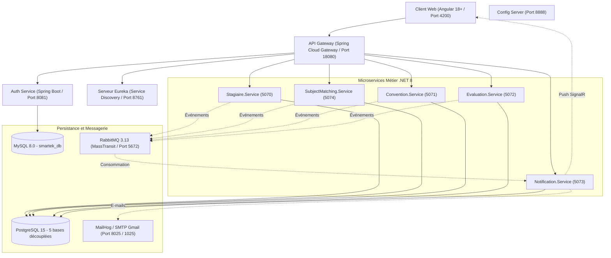

# STB StageConnect — Plateforme Intelligente de Gestion des Stages

<div align="center">

**Une plateforme de gestion du cycle de vie des stages basée sur une architecture microservices prête pour la production, développée lors d'un stage d'ingénieur d'été à la Société Tunisienne de Banque (STB)**

*Stage d'Ingénieur / Projet de Stage d'Été — Société Tunisienne de Banque (STB)*  
*Projet de Portfolio pour PFE & Candidatures en Ingénierie Logicielle*

---

[](./README.md)
[](./README.fr.md)

---

[](https://dotnet.microsoft.com/)
[](https://spring.io/projects/spring-boot)
[](https://angular.dev/)
[](https://www.postgresql.org/)
[](https://www.rabbitmq.com/)
[](https://www.docker.com/)
[](https://kubernetes.io/)
[](https://sharpapi.com/)
[](https://github.com/kaddachiabdelkader1234/STB-stageconnect/actions)

</div>

---

## 📖 Sommaire

1. [Présentation générale](#-présentation-générale)
2. [Fonctionnalités clés](#-fonctionnalités-clés)
3. [Architecture du système](#-architecture-du-système)
4. [Référence des microservices](#-référence-des-microservices)
5. [Moteur de matching IA des sujets](#-moteur-de-matching-ia-des-sujets)
6. [Système de notifications en temps réel](#-système-de-notifications-en-temps-réel)
7. [Sécurité et authentification](#-sécurité-et-authentification)
8. [Bus d'événements asynchrone RabbitMQ](#-bus-dévénements-asynchrone-rabbitmq)
9. [Démarrage rapide](#-démarrage-rapide)
10. [Comptes de démonstration](#-comptes-de-démonstration)
11. [Scénario de test de bout en bout (E2E)](#-scénario-de-test-de-bout-en-bout-e2e)
12. [Structure du projet](#-structure-du-projet)
13. [Résumé de la stack technique](#-résumé-de-la-stack-technique)
14. [Contribution](#-contribution)

---

## Présentation générale

**STB StageConnect** est un système complet et cloud-native de gestion des stages conçu pour numériser et automatiser l'intégralité du cycle de vie des stages au sein de la **Société Tunisienne de Banque (STB)**.

La plateforme repose sur une **architecture microservices hybride** :

- **Java / Spring Cloud** — API Gateway réactive, sécurité JWT, découverte de services Eureka, Config Server
- **.NET 8** — Cœur métier : gestion des candidatures, matching de sujets alimenté par l'IA, génération de conventions PDF, notifications temps réel SignalR
- **Angular 18+** — SPA réactive avec TailwindCSS, gestion d'état basée sur les signaux, centre de notifications latéral (slide-over)

> *Plateforme de gestion intelligente du cycle de vie des stagiaires pour la STB, reposant sur une architecture microservices hybride moderne.*

---

## Fonctionnalités clés

| Fonctionnalité | Description |
|:---|:---|
| 🧠 **Matching par IA** | Analyse sémantique automatique du CV via SharpAPI ; calcul d'un score déterministe de compatibilité (0–100%) avec les sujets de stage disponibles |
| 📋 **Candidatures en ligne** | Téléversement sécurisé de fichiers (CV + lettre de motivation), tableau de bord de suivi de candidature |
| 📄 **Conventions automatisées** | Génération de conventions en PDF avec QuestPDF dès l'acceptation de la candidature ; document prêt pour validation numérique |
| 📝 **Journal de bord hebdomadaire** | Suivi hebdomadaire des activités du stagiaire avec retours pédagogiques de l'encadrant |
| 🎓 **Évaluations et attestations** | Évaluations de mi-parcours et finale ; génération automatique d'attestations officielles de stage en PDF |
| 🔔 **Notifications unifiées** | Notifications push temps réel via SignalR + e-mails transactionnels HTML ; visibilité compartimentée par rôle |
| 🔒 **Contrôle d'accès granulaire (RBAC)** | Rôles ADMIN, TRAINER et LEARNER avec isolation stricte des données |
| 🔐 **Réinitialisation sécurisée du mot de passe** | Tokens à usage unique à durée limitée (15 min) transmis par e-mail |
| 📊 **Journal d'audit** | Traçabilité intégrale de l'ensemble des actions administratives sensibles |
| ☸️ **Prêt pour Kubernetes** | Manifestes K8s complets (Deployments, Services, HPA, Ingress) |

---

## Architecture du système



> Toutes les requêtes clientes transitent par l'API Gateway sur le port **`18080`** via les routes unifiées `/api/v1/**`. Aucun microservice n'est directement accessible depuis l'extérieur sans validation du token JWT.

---

## Référence des microservices

| Service | Technologie | Port | Responsabilités |
|:---|:---|:---|:---|
| **API Gateway** | Java Spring Cloud Gateway | `18080` | Point d'entrée unique, vérification JWT, routage dynamique Eureka, CORS unifié, limitation de débit (rate limiting), propagation du TraceId |
| **Auth Service** | Java Spring Boot 3.2 | `8081` | Gestion des comptes, authentification JWT, rotation des refresh tokens, hachage BCrypt, initialisation de l'administrateur, flux de réinitialisation de mot de passe |
| **Eureka Server** | Java Spring Cloud Netflix | `8761` | Registre de découverte dynamique des services |
| **Config Server** | Java Spring Cloud Config | `8888` | Distribution centralisée des configurations d'environnement |
| **Stagiaire.Service** | C# .NET 8 / EF Core | `5070` | Gestion des candidatures, profils stagiaires, stockage CV/lettres, journaux de bord hebdomadaires, journal d'audit |
| **SubjectMatching.Service** | C# .NET 8 / EF Core | `5074` | Catalogue des sujets de stage, analyse IA des CV (SharpAPI), moteur de scoring et d'attribution, demandes de changement de sujet |
| **Convention.Service** | C# .NET 8 / QuestPDF | `5071` | Cycle de vie des conventions, génération automatique de PDF avec support de signature numérique |
| **Evaluation.Service** | C# .NET 8 / QuestPDF | `5072` | Évaluations mi-parcours et finales, notation sur 20, statistiques, génération d'attestations officielles en PDF |
| **Notification.Service** | C# .NET 8 / SignalR | `5073` | Hub SignalR en temps réel (/hub/notifications), e-mails transactionnels HTML avec modèles aux couleurs de la STB, persistance des alertes in-app |
| **Frontend Angular** | Angular 18+ / TailwindCSS | `4200` | SPA réactive hébergée sous Nginx en production, Angular CLI en développement |

---

## Moteur de matching IA des sujets

Le microservice **`SubjectMatching.Service`** met en œuvre une chaîne de traitement automatisée :

### 1. Extraction du CV via SharpAPI

Lorsqu'un candidat soumet son CV, SharpAPI (`https://sharpapi.com/api/v1/hr/parse_resume`) analyse le document et extrait :
- **Compétences techniques** (langages de programmation, outils, frameworks)
- **Parcours académique** (diplômes, niveau, établissement)
- **Expérience pertinente et projets majeurs**

> **Haute disponibilité (Fallback) :** Si la clé API est absente ou si le quota est atteint, le service bascule automatiquement sur un mode dégradé (*mock parser*) sans interrompre l'expérience des administrateurs RH.

### 2. Moteur de scoring déterministe

- Compare les compétences du candidat avec les compétences requises et souhaitées pour chaque sujet ouvert
- Calcule un score pondéré de compatibilité (ex. **95%**)
- Génère une justification textuelle transparente pour les RH (ex. *"Le candidat maîtrise 5/5 compétences requises…"*)

### 3. Affectation et recommandation directe

- Le sujet le plus pertinent est automatiquement présélectionné dans le panneau d'acceptation
- L'administrateur valide l'acceptation, le sujet et l'encadrant en un seul clic

---

## Système de notifications en temps réel

Logique de notification par rôle pour chaque étape du cycle de vie :

| Événement déclencheur | Destinataire(s) | Message | Canaux |
|:---|:---|:---|:---|
| **Candidature soumise** | Admin RH | « Nouvelle candidature de {Prénom} {Nom} » | Volet latéral + Toast SignalR |
| **Candidature soumise** | Stagiaire | « Votre candidature a été enregistrée avec succès. » | Volet latéral + Toast SignalR |
| **Acceptation et affectation** | Stagiaire | « Félicitations, votre candidature a été acceptée. » | Volet latéral + Toast + E-mail |
| **Acceptation et affectation** | Encadrant | « Nouveau stagiaire affecté : {Prénom} {Nom} » | Volet latéral + Toast SignalR |
| **Sujet proposé** | Stagiaire | « Un sujet de stage vous a été proposé : Titre (Score : X%) » | Volet latéral + Toast + E-mail |
| **Sujet validé par le stagiaire** | Admin RH | « Sujet validé : le stagiaire a accepté Titre » | Volet latéral + Toast SignalR |
| **Demande de changement de sujet** | Admin RH | « Demande de changement de sujet : {Motif} » | Volet latéral + Toast SignalR |
| **Convention générée** | Stagiaire et Admin | « Votre convention de stage est disponible au téléchargement. » | Volet latéral + Toast + E-mail |
| **Évaluation enregistrée** | Admin RH | « Nouvelle évaluation pour {Nom} (note X/20) en attente de validation » | Volet latéral + Toast + E-mail |
| **Évaluation validée** | Stagiaire et Encadrant | « Votre évaluation a été validée. Note finale : X/20 » | Volet latéral + Toast + E-mail |

**Fonctionnalités :**
- **Centre de notifications latéral (Slide-over) :** Accessible via l'icône de cloche en haut à droite, avec onglets « Tout » et « Non lu », et action « Tout marquer comme lu »
- **Filtrage selon les rôles (ApplyReadScope) :** Les administrateurs ne reçoivent que les alertes d'administration ; chaque stagiaire et encadrant ne voit que ses propres notifications

---

## Sécurité et authentification

| Aspect | Implémentation |
|:---|:---|
| **JWT Stateless** | Tokens signés en HMAC-SHA256 (JWT_SECRET — clé partagée de 48 octets entre tous les services) |
| **Rotation des Refresh Tokens** | Stockés de façon sécurisée dans MySQL ; renouvelés automatiquement via un intercepteur Angular |
| **Réinitialisation de mot de passe** | Token unique à durée limitée (15 min) délivré via RabbitMQ et e-mail ; aucun mot de passe temporaire en clair n'est généré |
| **RBAC** | Rôles ADMIN, TRAINER, LEARNER — restriction stricte d'accès au niveau des couches de services |
| **Sécurité des téléversements** | Fichiers CV et lettres vérifiés par type MIME et taille maximale ; stockés hors de la racine web |

---

## Bus d'événements asynchrone RabbitMQ

L'ensemble des microservices communiquent de façon asynchrone via des messages fortement typés gérés par **MassTransit** :

| Contrat d'événement | Service émetteur | Service(s) consommateur(s) |
|:---|:---|:---|
| `CandidatureSubmitted` | Stagiaire.Service | Notification.Service |
| `CandidatureAccepted` | Stagiaire.Service | Convention.Service, Evaluation.Service, Notification.Service |
| `CandidatureRejected` | Stagiaire.Service | Notification.Service |
| `SubjectProposed` | SubjectMatching.Service | Notification.Service |
| `SubjectAccepted` | SubjectMatching.Service | Notification.Service |
| `SubjectChangeRequested` | SubjectMatching.Service | Notification.Service |
| `SubjectChangeReviewed` | SubjectMatching.Service | Notification.Service |
| `ConventionGenerated` | Convention.Service | Notification.Service |
| `EvaluationSubmitted` | Evaluation.Service | Notification.Service |
| `EvaluationValidated` | Evaluation.Service | Notification.Service |
| `PasswordResetRequested` | auth-service | Notification.Service |

---

## Démarrage rapide

### Prérequis

- [Docker Desktop](https://www.docker.com/products/docker-desktop/) avec Docker Compose v2
- Git

### 1. Cloner le dépôt

```bash
git clone https://github.com/kaddachiabdelkader1234/STB-stageconnect.git
cd STB-stageconnect
```

### 2. Configurer les variables d'environnement

```bash
cp .env.example .env
```

Éditez `.env` et complétez les valeurs essentielles :

| Variable | Description | Requis |
|:---|:---|:---|
| `JWT_SECRET` | Chaîne Base64 aléatoire, min 32 octets. Génération : `openssl rand -base64 48` | Oui |
| `SHARP_API_KEY` | Votre clé SharpAPI | Optionnel (fallback mock inclus) |
| `AI_MATCHING_PROVIDER` | `sharpapi` pour l'IA en direct ou `mock` pour les tests hors ligne | Oui |
| `SMTP_HOST` | `mailhog` en dev local ou `smtp.gmail.com` pour un serveur réel | Oui |

### 3. Démarrer tous les services

```bash
docker compose up -d --build
```

Vérifiez que tous les conteneurs sont en cours d'exécution :

```bash
docker compose ps
```

### 4. Accéder aux applications

| Composant | URL | Identifiants par défaut |
|:---|:---|:---|
| **Application Web STB** | http://localhost:4200 | — |
| **API Gateway** | http://localhost:18080 | — |
| **Console RabbitMQ** | http://localhost:15672 | guest / guest |
| **MailHog (UI E-mails)** | http://localhost:8025 | — |
| **Registre Eureka** | http://localhost:8761 | — |
| **Swagger — Sujets et IA** | http://localhost:5074/swagger | S'authentifier avec JWT |
| **Swagger — Candidatures** | http://localhost:5070/swagger | S'authentifier avec JWT |

---

## Comptes de démonstration

| Rôle | E-mail | Mot de passe | Description |
|:---|:---|:---|:---|
| **ADMIN (RH)** | `admin@stb.tn` | `Admin123!` | Droits d'administration complets |
| **STAGIAIRE (Candidat)** | `gadourkaddachi000@gmail.com` | `Stagiaire123!` | Stagiaire avec candidature et sujet proposé |
| **ENCADRANT (Tuteur)** | `encadrant@stb.tn` | `Encadrant123!` | Compte encadrant créé depuis l'interface admin |

---

## Scénario de test de bout en bout (E2E)

Suivez ce scénario pour tester le cycle de vie complet de la plateforme :

**Étape 1 — Créer un compte stagiaire**  
Rendez-vous sur `http://localhost:4200/auth/sign-up` et inscrivez un nouvel étudiant.

**Étape 2 — Soumettre une candidature**  
Connectez-vous, accédez à *Ma Candidature*, renseignez les informations et téléversez votre CV au format PDF. Le centre de notifications confirme immédiatement la soumission.

**Étape 3 — Matching IA et revue (Admin RH)**  
- Connectez-vous avec `admin@stb.tn`
- Consultez la cloche de notification (en haut à droite) signalant la nouvelle candidature
- Rendez-vous dans *Candidatures* et cliquez sur **Accepter**
- Observez les compétences extraites par l'IA ainsi que la présélection automatique du meilleur sujet (score jusqu'à 95%)
- Sélectionnez un encadrant et confirmez

**Étape 4 — Revue par le stagiaire**  
- Reconnectez-vous en tant que stagiaire
- Consultez l'onglet *Mon Sujet* : la description du sujet est affichée
- Validez le sujet ou soumettez une demande de modification motivée
- Téléchargez votre convention de stage générée depuis *Ma Convention*

**Étape 5 — Évaluation et attestation**  
- Connectez-vous en tant qu'encadrant pour évaluer le travail du stagiaire
- L'administrateur valide l'évaluation, ce qui génère l'attestation finale téléchargeable

**Étape 6 — Vérification des e-mails**  
Ouvrez MailHog sur `http://localhost:8025` pour visualiser tous les e-mails envoyés en temps réel avec la charte institutionnelle de la STB.

---

## Structure du projet

```
STB-stageconnect/
├── Backend/                          # Services d'infrastructure Spring Boot
│   ├── api-gateway/                  # Passerelle réactive Spring Cloud Gateway
│   ├── auth-service/                 # Authentification & gestion des comptes (MySQL)
│   ├── config-server/                # Serveur de configuration centralisé
│   └── eureka-server/                # Registre de découverte de services Eureka
│
├── Stagiaire.Service/                # .NET 8 — Candidatures & profils stagiaires
├── SubjectMatching.Service/          # .NET 8 — IA (SharpAPI) & sujets de stage
├── Convention.Service/               # .NET 8 — Génération des conventions PDF (QuestPDF)
├── Evaluation.Service/               # .NET 8 — Évaluations & Attestations (QuestPDF)
├── Notification.Service/             # .NET 8 — Hub SignalR & e-mails SMTP
│
├── Stagiaire.Contracts/              # Contrats d'événements asynchrones partagés (MassTransit)
├── Smartek.Common/                   # Middlewares partagés (JWT, erreurs, traçabilité)
├── Stagiaire.Service.Tests/          # Suite de tests unitaires et d'intégration
│
├── Frontend/
│   └── angular-app/                  # SPA Angular 18+ (TailwindCSS, signaux)
│
├── k8s/                              # Manifestes Kubernetes (Deployments, HPA, Ingress)
├── monitoring/                       # Configuration Prometheus & Grafana
├── nginx/                            # Configuration Nginx (production + TLS)
├── scripts/                          # Utilitaires de dev, smoke tests, génération certs
│
├── docker-compose.yml                # Déploiement multi-conteneurs local complet
├── .env.example                      # Modèle de variables d'environnement
├── README.md                         # Documentation en anglais
└── README.fr.md                      # Documentation en français
```

---

## Résumé de la stack technique

| Catégorie | Technologies |
|:---|:---|
| **Backend (Java)** | Spring Boot 3.2, Spring Cloud Gateway, Spring Security, Eureka, Config Server |
| **Backend (.NET)** | ASP.NET Core 8, Entity Framework Core 8, MassTransit, SignalR, QuestPDF |
| **Frontend** | Angular 18+, TailwindCSS, RxJS, Angular Signals |
| **Bases de données** | MySQL 8.0 (auth), PostgreSQL 15 (5 bases métier) |
| **Messagerie** | RabbitMQ 3.13, MassTransit |
| **IA / ML** | Analyseur de CV SharpAPI RH, Moteur de scoring déterministe |
| **DevOps** | Docker Compose, Kubernetes, GitHub Actions CI, Nginx |
| **Monitoring** | Prometheus, Grafana |
| **Sécurité** | JWT (HMAC-SHA256), BCrypt, Refresh Tokens avec rotation, RBAC |

---

## Contribution

Les contributions, retours et signalements de bugs sont les bienvenus !

1. Forkez le dépôt
2. Créez une branche de fonctionnalité : `git checkout -b feature/nom-de-fonctionnalite`
3. Committez vos modifications : `git commit -m "feat: ajout d'une fonctionnalité"`
4. Poussez sur la branche : `git push origin feature/nom-de-fonctionnalite`
5. Ouvrez une Pull Request vers `develop`

Veuillez consulter [CONTRIBUTING.md](./CONTRIBUTING.md) pour les directives détaillées.

---

<div align="center">

*Développé lors d'un Stage d'Ingénieur d'Été à la Société Tunisienne de Banque (STB)*  
*Auteur : Abdelkader Kaddachi — Élève Ingénieur en Génie Logiciel*

**⭐ N'hésitez pas à ajouter une étoile à ce dépôt si vous le trouvez utile !**

</div>
