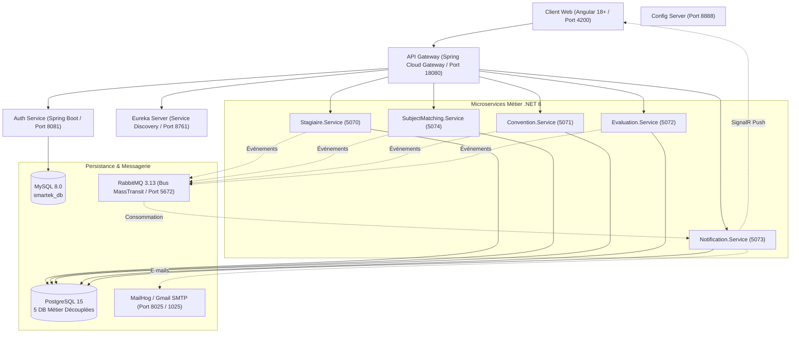

# STB StageConnect — Plateforme Intelligente de Gestion des Stagiaires (STB)

[](https://dotnet.microsoft.com/)
[](https://spring.io/projects/spring-boot)
[](https://angular.dev/)
[](https://www.rabbitmq.com/)
[](https://www.postgresql.org/)
[](https://sharpapi.com/)

Plateforme de gestion complète du cycle de vie des stagiaires pour la **Société Tunisienne de Banque (STB)**.
Elle repose sur une architecture microservices hybride moderne combinant **Java / Spring Cloud** (passerelle réactive, sécurité JWT, découverte Eureka) et **.NET 8** (cœur métier, génération PDF, IA d'appariement, notifications en temps réel SignalR), couplée à une interface frontend réactive **Angular** (TailwindCSS, signaux réactifs, slide-over notification center).

---

## 📋 Table des Matières

1. [Fonctionnalités Principales](#-fonctionnalités-principales)
2. [Architecture Globale](#-architecture-globale)
3. [Microservices et Rôles](#-microservices-et-rôles)
4. [Intelligence Artificielle & Appariement des Sujets](#-intelligence-artificielle--appariement-des-sujets)
5. [Système de Notifications Unifié](#-système-de-notifications-unifié)
6. [Sécurité & Réinitialisation de Mot de Passe](#-sécurité--réinitialisation-de-mot-de-passe)
7. [Événements Asynchrones RabbitMQ](#-événements-asynchrones-rabbitmq)
8. [Démarrage Rapide](#-démarrage-rapide)
9. [Comptes de Démonstration](#-comptes-de-démonstration)
10. [Guide de Test Pas-à-Pas](#-guide-de-test-pas-à-pas)
11. [Structure du Projet](#-structure-du-projet)

---

## 🌟 Fonctionnalités Principales

- **Candidatures & Dépôt en Ligne :** Formulaire candidat avec upload sécurisé du CV et de la lettre de motivation/demande de stage.
- **Appariement Intelligent de Sujets par IA (SharpAPI) :** Analyse sémantique automatique du CV dès la soumission, extraction des compétences techniques, formation et projets, et calcul déterministe d'un score de compatibilité (0–100%) avec les sujets proposés par les directions de la STB.
- **Workflow d'Acceptation Unifié :** Recommandation instantanée du meilleur sujet pour le candidat lors de l'examen par l'administrateur RH, affectation simultanée du sujet et de l'encadrant.
- **Espace Stagiaire « Mon Sujet » :** Consultation de la fiche descriptive du sujet affecté, confirmation d'acceptation ou demande de changement motivée soumise à l'administration.
- **Conventions Automatisées :** Génération automatique de la convention de stage en PDF (QuestPDF) dès l'acceptation du dossier, téléchargement et signature.
- **Journal de Bord Hebdomadaire :** Saisie des tâches hebdomadaires par le stagiaire et validation/commentaires pédagogiques par l'encadrant.
- **Évaluations & Attestations Officielles :** Évaluation à mi-parcours et finale par l'encadrant, validation par l'administration, et génération instantanée de l'attestation de stage en PDF.
- **Centre de Notifications Unifié (SignalR + Email) :** Volet latéral interactif (*slide-over panel*), badge de compteur non-lu dynamique, popups toast temps réel et emails transactionnels HTML aux couleurs de la STB.
- **Réinitialisation Sécurisée de Mot de Passe :** Demande de lien de réinitialisation avec jeton temporaire chiffré à usage unique envoyé par e-mail.
- **Rôles & Sécurité Granulaire :** Isolation stricte des données (*Scoping*) entre `ADMIN`, `TRAINER` (encadrant) et `LEARNER` (stagiaire).
- **Journal d'Audit Consolidé :** Traçabilité exhaustive de toutes les actions administratives sensibles.

---

## 🏗️ Architecture Globale



Toutes les requêtes de l'application cliente transitent par l'API Gateway sur le port **`18080`** via les routes unifiées `/api/v1/**`. Aucun microservice n'est directement accessible depuis l'extérieur sans contrôle d'authentification.

---

## 🚀 Microservices et Rôles

| Service | Technologie | Port | Description & Responsabilités |
| :--- | :--- | :--- | :--- |
| **API Gateway** | Java Spring Cloud Gateway | `18080` | Point d'entrée unique, vérification JWT, routage dynamique via Eureka, CORS unifié, rate limiting, propagation du `TraceId`. |
| **Auth Service** | Java Spring Boot 3.2 | `8081` | Gestion des comptes, authentification JWT, refresh tokens rotatifs, hachage BCrypt, initialisation de l'administrateur, workflow mot de passe oublié. |
| **Eureka Server** | Java Spring Cloud Netflix | `8761` | Annuaire et découverte dynamique des microservices. |
| **Config Server** | Java Spring Cloud Config | `8888` | Distribution centralisée des configurations environnementales. |
| **Stagiaire.Service** | C# .NET 8 / EF Core | `5070` | Gestion des candidatures, fiches stagiaires, stockage des CVs/demandes, journaux de bord hebdomadaires, journal d'audit. |
| **SubjectMatching.Service** | C# .NET 8 / EF Core | `5074` | Catalogue des sujets de stage, extraction sémantique des CVs par IA (SharpAPI), moteur de scoring et d'affectation, requêtes de changement de sujet. |
| **Convention.Service** | C# .NET 8 / QuestPDF | `5071` | Cycle de vie des conventions, génération automatique des PDFs officiels avec signature numérique. |
| **Evaluation.Service** | C# .NET 8 / QuestPDF | `5072` | Évaluations mi-parcours et finales, notation sur 20, statistiques, génération des attestations officielles de stage. |
| **Notification.Service** | C# .NET 8 / SignalR | `5073` | Hub temps réel SignalR (`/hub/notifications`), e-mails transactionnels HTML avec templates STB, persistance des alertes in-app. |
| **Frontend Angular** | Angular 18+ / TailwindCSS | `4200` | SPA réactive hébergée sous Nginx en production (ou Angular CLI en développement local). |

---

## 🤖 Intelligence Artificielle & Appariement des Sujets

Le microservice **`SubjectMatching.Service`** intègre une chaîne de traitement automatisée :

1. **Extraction de CV via SharpAPI :**
   - Lorsqu'un candidat soumet son CV, l'API RH SharpAPI (`https://sharpapi.com/api/v1/hr/parse_resume`) analyse le document binaire.
   - Les entités extraites incluent : compétences techniques clés (*skills*), diplômes et niveau académique (*education*), expériences pertinentes et projets majeurs.
   - **Haute Disponibilité (Fallback) :** En cas d'indisponibilité de la clé API tierce ou de quota épuisé, le service bascule automatiquement en mode dégradé (*mock parser*) sans interrompre le travail de l'administrateur.
2. **Moteur Déterministe d'Appariement (Scoring Engine) :**
   - Compare les compétences du candidat avec celles requises et souhaitées de chaque sujet ouvert.
   - Calcule un score de compatibilité pondéré (ex. **95%**).
   - Génère une justification textuelle transparente pour le responsable RH (*« Le candidat maîtrise 5/5 compétences requises... »*).
3. **Affectation Directe et Recommandation :**
   - Dans le volet d'acceptation, le sujet le plus pertinent est pré-sélectionné automatiquement.
   - L'administrateur confirme en un clic l'acceptation, le sujet et l'encadrant.

---

## 🔔 Système de Notifications Unifié

La plateforme implémente une logique de notification sur mesure pour chaque type d'utilisateur :

| Événement Déclencheur | Destinataire(s) | Message Notifié | Canaux |
| :--- | :--- | :--- | :--- |
| **Dépôt d'une candidature** | **Admin RH** | 📋 *« Nouvelle candidature déposée par {Prénom} {Nom} »* | 🔔 Slide-over + Toast SignalR |
| | **Stagiaire** | 📋 *« Votre candidature a été enregistrée avec succès. »* | 🔔 Slide-over + Toast SignalR |
| **Acceptation & affectation** | **Stagiaire** | 🎉 *« Félicitations, votre candidature a été acceptée. »* | 🔔 Slide-over + Toast + ✉️ E-mail |
| | **Encadrant** | 👤 *« Nouveau stagiaire attribué : {Prénom} {Nom} vous a été assigné »* | 🔔 Slide-over + Toast SignalR |
| **Proposition de sujet de stage**| **Stagiaire** | 💡 *« Un sujet de stage vous a été proposé : "{Titre}" (Score : {Score}%) »* | 🔔 Slide-over + Toast + ✉️ E-mail |
| **Validation du sujet par l'élève**| **Admin RH** | 🎯 *« Sujet validé : Le stagiaire a accepté le sujet "{Titre}" »* | 🔔 Slide-over + Toast SignalR |
| **Demande de changement de sujet**| **Admin RH** | 🔄 *« Demande de changement de sujet : {Motif} »* | 🔔 Slide-over + Toast SignalR |
| **Génération de convention** | **Stagiaire & Admin**| 📄 *« Votre convention de stage est disponible au téléchargement. »* | 🔔 Slide-over + Toast + ✉️ E-mail |
| **Évaluation enregistrée** | **Admin RH** | 📝 *« Nouvelle évaluation de {Nom} (note {Note}/20) en attente de validation »* | 🔔 Slide-over + Toast + ✉️ E-mail |
| **Évaluation validée** | **Stagiaire & Encadrant**| ✅ *« Votre évaluation a été validée. Note finale : {Note}/20 »* | 🔔 Slide-over + Toast + ✉️ E-mail |

- **Slide-over Notification Center :** Panneau latéral accessible via l'icône de cloche dans la barre supérieure, avec onglets *« Toutes »* et *« Non lues »*, et action *« Tout marquer comme lu »*.
- **Scoping par Rôle (`ApplyReadScope`) :** L'administrateur ne voit que les alertes d'administration, tandis que chaque stagiaire et encadrant ne voit strictement que ses notifications personnelles.

---

## 🔒 Sécurité & Réinitialisation de Mot de Passe

- **Authentification Stateless JWT :** Tokens signés en HMAC-SHA256 (`JWT_SECRET` partagé de 48 octets).
- **Refresh Tokens Rotatifs :** Stockés de manière sécurisée en base MySQL et renouvelés automatiquement via l'intercepteur Angular.
- **Réinitialisation Sécurisée :**
  1. L'utilisateur clique sur *« Mot de passe oublié ? »* et saisit son adresse email.
  2. Un token de réinitialisation unique à durée limitée (15 minutes) est généré et transmis via RabbitMQ.
  3. L'utilisateur reçoit un e-mail avec un lien direct vers la page de réinitialisation (`/auth/reset-password?token=...`).
  4. L'utilisateur définit son nouveau mot de passe directement sans qu'aucun mot de passe temporaire en clair ne soit généré.

---

## 📬 Événements Asynchrones RabbitMQ

Les microservices communiquent de manière totalement asynchrone via des messages typés gérés par **MassTransit** :

| Contrat d'Événement | Microservice Émetteur | Microservice(s) Consommateur(s) |
| :--- | :--- | :--- |
| `CandidatureSubmitted` | `Stagiaire.Service` | `Notification.Service` |
| `CandidatureAccepted` | `Stagiaire.Service` | `Convention.Service`, `Evaluation.Service`, `Notification.Service` |
| `CandidatureRejected` | `Stagiaire.Service` | `Notification.Service` |
| `SubjectProposed` | `SubjectMatching.Service` | `Notification.Service` |
| `SubjectAccepted` | `SubjectMatching.Service` | `Notification.Service` |
| `SubjectChangeRequested`| `SubjectMatching.Service` | `Notification.Service` |
| `SubjectChangeReviewed` | `SubjectMatching.Service` | `Notification.Service` |
| `ConventionGenerated` | `Convention.Service` | `Notification.Service` |
| `EvaluationSubmitted` | `Evaluation.Service` | `Notification.Service` |
| `EvaluationValidated` | `Evaluation.Service` | `Notification.Service` |
| `PasswordResetRequested`| `auth-service` | `Notification.Service` |

---

## 🔧 Démarrage Rapide

### 1. Configuration de l'Environnement

Créez le fichier `.env` à la racine à partir de `.env.example` :

```bash
cp .env.example .env
```

Vérifiez les variables clés :
- `JWT_SECRET` : chaîne aléatoire sécurisée en Base64.
- `SHARP_API_KEY` : votre clé d'API SharpAPI.
- `AI_MATCHING_PROVIDER=sharpapi` (ou `mock` pour tester hors-ligne).
- `SMTP_HOST=mailhog` et `SMTP_PORT=1025` pour le développement local.

### 2. Démarrage de tous les services (Docker Compose)

```bash
docker compose up -d --build
```

Vérifiez que tous les conteneurs sont sains (*healthy*) :

```bash
docker compose ps
```

### 3. Accès aux Applications et Interfaces

| Composant | URL | Identifiants par défaut |
| :--- | :--- | :--- |
| **Application Web STB** | <http://localhost:4200> | — |
| **API Gateway** | <http://localhost:18080> | — |
| **Console RabbitMQ** | <http://localhost:15672> | `guest` / `guest` |
| **Serveur MailHog (Emails)**| <http://localhost:8025> | — |
| **Registre Eureka** | <http://localhost:8761> | — |
| **Swagger Sujets & IA** | <http://localhost:5074/swagger> | S'authentifier avec JWT |
| **Swagger Candidatures** | <http://localhost:5070/swagger> | S'authentifier avec JWT |

---

## 🔑 Comptes de Démonstration

| Rôle | Adresse E-mail | Mot de Passe | Description |
| :--- | :--- | :--- | :--- |
| **ADMIN RH** | `admin@stb.tn` | `Admin123!` | Compte administrateur avec tous les droits de gestion. |
| **STAGIAIRE (Candidat)** | `gadourkaddachi000@gmail.com` | `Stagiaire123!` | Compte stagiaire avec candidature et sujet proposés. |
| **ENCADRANT (Tuteur)** | `encadrant@stb.tn` | `Encadrant123!` | Compte encadrant créé depuis le panneau d'administration. |

---

## 🧪 Guide de Test Pas-à-Pas (Scénario Complet)

1. **Création d'un Compte Stagiaire :** Rendez-vous sur <http://localhost:4200/auth/sign-up> et inscrivez un nouvel étudiant.
2. **Dépôt de Candidature :** Connectez-vous, accédez à *« Ma Candidature »*, remplissez les informations et déposez votre CV au format PDF. Le centre de notification confirme instantanément le dépôt.
3. **Examen & Appariement IA (Admin RH) :**
   - Connectez-vous en tant qu'administrateur (`admin@stb.tn`).
   - Consultez la notification reçue dans la cloche en haut à droite.
   - Accédez à *« Candidatures »* et cliquez sur **« Accepter »**.
   - Constatez l'affichage des compétences extraites par l'IA et la pré-sélection automatique du meilleur sujet (score jusqu'à 95%).
   - Sélectionnez un encadrant et validez.
4. **Consultation par le Stagiaire :**
   - Reconnectez-vous en stagiaire.
   - Consultez l'onglet *« Mon Sujet »* : la fiche descriptive du sujet est affichée.
   - Vous pouvez soit valider le sujet, soit formuler une demande de changement avec un motif.
   - Téléchargez votre convention de stage générée au format PDF dans *« Ma Convention »*.
5. **Évaluation et Attestation :**
   - Connectez-vous en encadrant pour évaluer le travail du stagiaire.
   - L'administrateur valide l'évaluation, déclenchant l'attestation finale téléchargeable.
6. **Contrôle des E-mails :** Ouvrez MailHog (<http://localhost:8025>) pour observer tous les e-mails envoyés en temps réel avec leur mise en page institutionnelle STB.

---

## 📁 Structure du Projet

```
gestion-des-stagiere/
├── Backend/                         # Composants d'infrastructure Spring Boot
│   ├── api-gateway/                 # Passerelle réactive Spring Cloud Gateway
│   ├── auth-service/                # Microservice d'authentification et comptes MySQL
│   ├── config-server/               # Serveur de configuration centralisé
│   └── eureka-server/               # Annuaire de découverte de services Eureka
├── Stagiaire.Service/               # Microservice .NET 8 (Candidatures & Stagiaires)
├── SubjectMatching.Service/         # Microservice .NET 8 (IA SharpAPI & Sujets de Stage)
├── Convention.Service/              # Microservice .NET 8 (Génération PDF QuestPDF)
├── Evaluation.Service/              # Microservice .NET 8 (Évaluations & Attestations)
├── Notification.Service/            # Microservice .NET 8 (Hub SignalR & E-mails SMTP)
├── Stagiaire.Contracts/             # Bibliothèque d'événements asynchrones MassTransit
├── Smartek.Common/                  # Middleware commun (JWT, Erreurs, Traçabilité)
├── Frontend/angular-app/            # Application Web SPA Angular 18+ (TailwindCSS)
├── k8s/                             # Manifestes de déploiement Kubernetes
├── docker-compose.yml               # Déploiement multi-conteneurs local
└── README.md                        # Documentation officielle du projet
```

---

*Développé pour la Société Tunisienne de Banque (STB) — Année Universitaire 2025/2026.*
