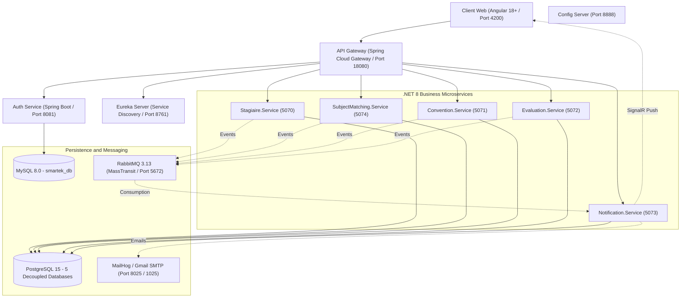

# STB StageConnect — Intelligent Internship Management Platform

<div align="center">

**A production-grade, microservices-based internship lifecycle platform built for the Société Tunisienne de Banque (STB)**

*Projet de Fin d'Études (PFE) — Année Universitaire 2025/2026*

---

[](https://dotnet.microsoft.com/)
[](https://spring.io/projects/spring-boot)
[](https://angular.dev/)
[](https://www.postgresql.org/)
[](https://www.rabbitmq.com/)
[](https://www.docker.com/)
[](https://kubernetes.io/)
[](https://sharpapi.com/)
[](https://github.com/kaddachiabdelkader1234/STB-stageconnect/actions)

</div>

---

## 📖 Table of Contents

1. [Overview](#-overview)
2. [Key Features](#-key-features)
3. [System Architecture](#-system-architecture)
4. [Microservices Reference](#-microservices-reference)
5. [AI Subject Matching Engine](#-ai-subject-matching-engine)
6. [Real-Time Notification System](#-real-time-notification-system)
7. [Security and Authentication](#-security-and-authentication)
8. [Asynchronous Event Bus RabbitMQ](#-asynchronous-event-bus-rabbitmq)
9. [Quick Start](#-quick-start)
10. [Demo Accounts](#-demo-accounts)
11. [End-to-End Test Walkthrough](#-end-to-end-test-walkthrough)
12. [Project Structure](#-project-structure)
13. [Tech Stack Summary](#-tech-stack-summary)
14. [Contributing](#-contributing)

---

## Overview

**STB StageConnect** is a full-stack, cloud-native internship management system designed to digitize and automate the entire internship lifecycle at the **Société Tunisienne de Banque (STB)**.

The platform is built on a **hybrid microservices architecture**:

- **Java / Spring Cloud** — Reactive API Gateway, JWT security, Eureka service discovery, Config Server
- **.NET 8** — Business core: candidacy management, AI-powered subject matching, PDF convention generation, real-time SignalR notifications
- **Angular 18+** — Reactive SPA with TailwindCSS, signal-based state, slide-over notification center

> *Plateforme de gestion intelligente du cycle de vie des stagiaires pour la STB, reposant sur une architecture microservices hybride moderne.*

---

## Key Features

| Feature | Description |
|:---|:---|
| 🧠 **AI-Powered Matching** | Automatic semantic CV analysis via SharpAPI; deterministic compatibility scoring (0–100%) against available internship subjects |
| 📋 **Online Applications** | Secure file upload (CV + cover letter), application tracking dashboard |
| 📄 **Automated Conventions** | PDF generation with QuestPDF upon application acceptance; digital-ready output |
| 📝 **Weekly Logbook** | Intern weekly task journal with supervisor pedagogical feedback |
| 🎓 **Evaluations and Certificates** | Mid-term and final evaluations; auto-generated official PDF attestations |
| 🔔 **Unified Notifications** | Real-time SignalR push + transactional HTML emails; per-role scoping |
| 🔒 **Granular RBAC** | ADMIN, TRAINER, and LEARNER roles with strict data isolation |
| 🔐 **Secure Password Reset** | Time-limited (15 min) one-time tokens delivered via email |
| 📊 **Audit Log** | Full traceability of all sensitive administrative actions |
| ☸️ **Kubernetes Ready** | Complete K8s manifests (Deployments, Services, HPA, Ingress) |

---

## System Architecture



> All client requests pass through the API Gateway on port **`18080`** via unified `/api/v1/**` routes. No microservice is directly reachable externally without JWT validation.

---

## Microservices Reference

| Service | Technology | Port | Responsibilities |
|:---|:---|:---|:---|
| **API Gateway** | Java Spring Cloud Gateway | `18080` | Single entry point, JWT verification, dynamic Eureka routing, unified CORS, rate limiting, TraceId propagation |
| **Auth Service** | Java Spring Boot 3.2 | `8081` | Account management, JWT auth, rotating refresh tokens, BCrypt hashing, admin seed, forgotten password workflow |
| **Eureka Server** | Java Spring Cloud Netflix | `8761` | Dynamic service discovery registry |
| **Config Server** | Java Spring Cloud Config | `8888` | Centralized environment configuration distribution |
| **Stagiaire.Service** | C# .NET 8 / EF Core | `5070` | Candidacy management, intern profiles, CV/letter storage, weekly logbooks, audit log |
| **SubjectMatching.Service** | C# .NET 8 / EF Core | `5074` | Internship subject catalog, AI CV parsing (SharpAPI), scoring engine and assignment, subject change requests |
| **Convention.Service** | C# .NET 8 / QuestPDF | `5071` | Convention lifecycle, automatic PDF generation with digital signature support |
| **Evaluation.Service** | C# .NET 8 / QuestPDF | `5072` | Mid-term and final evaluations, scoring out of 20, statistics, official PDF attestation generation |
| **Notification.Service** | C# .NET 8 / SignalR | `5073` | Real-time SignalR hub (/hub/notifications), transactional HTML emails with STB templates, in-app alert persistence |
| **Frontend Angular** | Angular 18+ / TailwindCSS | `4200` | Reactive SPA; Nginx-hosted in production, Angular CLI in development |

---

## AI Subject Matching Engine

The **`SubjectMatching.Service`** implements an automated processing chain:

### 1. CV Extraction via SharpAPI

When a candidate submits their CV, SharpAPI (`https://sharpapi.com/api/v1/hr/parse_resume`) analyses the document and extracts:
- **Technical skills** (programming languages, tools, frameworks)
- **Academic background** (degrees, level, institution)
- **Relevant experience and major projects**

> **High Availability (Fallback):** If the API key is unavailable or quota is exhausted, the service automatically switches to a degraded *mock parser* mode without interrupting HR administrator workflows.

### 2. Deterministic Scoring Engine

- Compares candidate skills against required and desired skills per open subject
- Computes a weighted compatibility score (e.g., **95%**)
- Generates a transparent textual justification for HR (e.g., *"The candidate masters 5/5 required skills…"*)

### 3. Direct Assignment and Recommendation

- The most relevant subject is automatically pre-selected in the acceptance panel
- The administrator confirms acceptance, subject, and supervisor in a single click

---

## Real-Time Notification System

Per-role notification logic across all lifecycle events:

| Triggering Event | Recipient(s) | Message | Channels |
|:---|:---|:---|:---|
| **Application submitted** | HR Admin | "New application from {First} {Last}" | Slide-over + SignalR Toast |
| **Application submitted** | Intern | "Your application has been registered successfully." | Slide-over + SignalR Toast |
| **Acceptance and assignment** | Intern | "Congratulations, your application has been accepted." | Slide-over + Toast + Email |
| **Acceptance and assignment** | Supervisor | "New intern assigned: {First} {Last}" | Slide-over + SignalR Toast |
| **Subject proposed** | Intern | "An internship subject has been proposed: Title (Score: X%)" | Slide-over + Toast + Email |
| **Subject validated by intern** | HR Admin | "Subject validated: intern accepted Title" | Slide-over + SignalR Toast |
| **Subject change request** | HR Admin | "Subject change request: {Reason}" | Slide-over + SignalR Toast |
| **Convention generated** | Intern and Admin | "Your internship convention is available for download." | Slide-over + Toast + Email |
| **Evaluation recorded** | HR Admin | "New evaluation for {Name} (grade X/20) pending validation" | Slide-over + Toast + Email |
| **Evaluation validated** | Intern and Supervisor | "Your evaluation has been validated. Final grade: X/20" | Slide-over + Toast + Email |

**Features:**
- **Slide-over Notification Center:** Accessible via the bell icon in the top bar, with "All" and "Unread" tabs, and "Mark all as read" action
- **Role-based Scoping (ApplyReadScope):** Admins see only admin alerts; each intern and supervisor sees strictly their own notifications

---

## Security and Authentication

| Aspect | Implementation |
|:---|:---|
| **Stateless JWT** | Tokens signed with HMAC-SHA256 (JWT_SECRET — shared 48-byte key across all services) |
| **Rotating Refresh Tokens** | Stored securely in MySQL; automatically renewed via Angular interceptor |
| **Password Reset Flow** | Unique time-limited token (15 min) delivered via RabbitMQ and email; no plaintext temporary password ever generated |
| **RBAC** | ADMIN, TRAINER, LEARNER — strict data scoping at the service layer |
| **File Upload Security** | CV and letter uploads validated for type and size; stored outside web root |

---

## Asynchronous Event Bus RabbitMQ

All microservices communicate asynchronously via typed messages managed by **MassTransit**:

| Event Contract | Emitting Service | Consuming Service(s) |
|:---|:---|:---|
| `CandidatureSubmitted` | Stagiaire.Service | Notification.Service |
| `CandidatureAccepted` | Stagiaire.Service | Convention.Service, Evaluation.Service, Notification.Service |
| `CandidatureRejected` | Stagiaire.Service | Notification.Service |
| `SubjectProposed` | SubjectMatching.Service | Notification.Service |
| `SubjectAccepted` | SubjectMatching.Service | Notification.Service |
| `SubjectChangeRequested` | SubjectMatching.Service | Notification.Service |
| `SubjectChangeReviewed` | SubjectMatching.Service | Notification.Service |
| `ConventionGenerated` | Convention.Service | Notification.Service |
| `EvaluationSubmitted` | Evaluation.Service | Notification.Service |
| `EvaluationValidated` | Evaluation.Service | Notification.Service |
| `PasswordResetRequested` | auth-service | Notification.Service |

---

## Quick Start

### Prerequisites

- [Docker Desktop](https://www.docker.com/products/docker-desktop/) with Docker Compose v2
- Git

### 1. Clone the Repository

```bash
git clone https://github.com/kaddachiabdelkader1234/STB-stageconnect.git
cd STB-stageconnect
```

### 2. Configure Environment Variables

```bash
cp .env.example .env
```

Edit `.env` and fill in the key values:

| Variable | Description | Required |
|:---|:---|:---|
| `JWT_SECRET` | Random Base64 string, min 32 bytes. Generate: `openssl rand -base64 48` | Yes |
| `SHARP_API_KEY` | Your SharpAPI key | Optional (mock fallback available) |
| `AI_MATCHING_PROVIDER` | `sharpapi` for live AI or `mock` for offline testing | Yes |
| `SMTP_HOST` | `mailhog` for local dev or `smtp.gmail.com` for real email | Yes |

### 3. Start All Services

```bash
docker compose up -d --build
```

Verify all containers are healthy:

```bash
docker compose ps
```

### 4. Access the Applications

| Component | URL | Default Credentials |
|:---|:---|:---|
| **STB Web Application** | http://localhost:4200 | — |
| **API Gateway** | http://localhost:18080 | — |
| **RabbitMQ Console** | http://localhost:15672 | guest / guest |
| **MailHog (Email UI)** | http://localhost:8025 | — |
| **Eureka Registry** | http://localhost:8761 | — |
| **Swagger — Subjects and AI** | http://localhost:5074/swagger | Authenticate with JWT |
| **Swagger — Candidacies** | http://localhost:5070/swagger | Authenticate with JWT |

---

## Demo Accounts

| Role | Email | Password | Description |
|:---|:---|:---|:---|
| **ADMIN (HR)** | `admin@stb.tn` | `Admin123!` | Full administration rights |
| **INTERN (Candidate)** | `gadourkaddachi000@gmail.com` | `Stagiaire123!` | Intern with candidacy and proposed subject |
| **SUPERVISOR (Trainer)** | `encadrant@stb.tn` | `Encadrant123!` | Supervisor account created from admin panel |

---

## End-to-End Test Walkthrough

Follow this complete scenario to test the full platform lifecycle:

**Step 1 — Create an Intern Account**
Navigate to `http://localhost:4200/auth/sign-up` and register a new student.

**Step 2 — Submit an Application**
Log in, go to *My Application*, fill in the details, and upload your CV in PDF format. The notification center instantly confirms the submission.

**Step 3 — AI Matching and Review (HR Admin)**
- Log in as `admin@stb.tn`
- Check the notification bell (top right) for the new application alert
- Navigate to *Applications* and click **Accept**
- Observe AI-extracted skills and the automatic best-subject pre-selection (up to 95% score)
- Select a supervisor and confirm

**Step 4 — Intern Review**
- Log back in as the intern
- Check *My Subject* tab: the subject description is displayed
- Either validate the subject or request a change with a justification
- Download your generated convention PDF from *My Convention*

**Step 5 — Evaluation and Attestation**
- Log in as supervisor to evaluate the intern's work
- Admin validates the evaluation, triggering the downloadable final attestation

**Step 6 — Email Verification**
Open MailHog at `http://localhost:8025` to see all emails sent in real-time with the STB institutional layout.

---

## Project Structure

```
STB-stageconnect/
├── Backend/                          # Spring Boot infrastructure services
│   ├── api-gateway/                  # Reactive Spring Cloud Gateway
│   ├── auth-service/                 # Authentication & accounts (MySQL)
│   ├── config-server/                # Centralized configuration server
│   └── eureka-server/                # Eureka service discovery registry
│
├── Stagiaire.Service/                # .NET 8 — Candidacies & Intern profiles
├── SubjectMatching.Service/          # .NET 8 — AI (SharpAPI) & Internship subjects
├── Convention.Service/               # .NET 8 — PDF convention generation (QuestPDF)
├── Evaluation.Service/               # .NET 8 — Evaluations & Attestations (QuestPDF)
├── Notification.Service/             # .NET 8 — SignalR hub & SMTP emails
│
├── Stagiaire.Contracts/              # Shared async event contracts (MassTransit)
├── Smartek.Common/                   # Common middleware (JWT, errors, tracing)
├── Stagiaire.Service.Tests/          # Unit & integration test suite
│
├── Frontend/
│   └── angular-app/                  # Angular 18+ SPA (TailwindCSS, signals)
│
├── k8s/                              # Kubernetes manifests (Deployments, HPA, Ingress)
├── monitoring/                       # Prometheus & Grafana configuration
├── nginx/                            # Nginx config (production + TLS)
├── scripts/                          # Dev utilities, smoke tests, cert generation
│
├── docker-compose.yml                # Full local multi-container deployment
├── .env.example                      # Environment variable template
└── README.md                         # This file
```

---

## Tech Stack Summary

| Category | Technologies |
|:---|:---|
| **Backend (Java)** | Spring Boot 3.2, Spring Cloud Gateway, Spring Security, Eureka, Config Server |
| **Backend (.NET)** | ASP.NET Core 8, Entity Framework Core 8, MassTransit, SignalR, QuestPDF |
| **Frontend** | Angular 18+, TailwindCSS, RxJS, Angular Signals |
| **Databases** | MySQL 8.0 (auth), PostgreSQL 15 (5 business DBs) |
| **Messaging** | RabbitMQ 3.13, MassTransit |
| **AI / ML** | SharpAPI HR CV Parser, Deterministic Scoring Engine |
| **DevOps** | Docker Compose, Kubernetes, GitHub Actions CI, Nginx |
| **Monitoring** | Prometheus, Grafana |
| **Security** | JWT (HMAC-SHA256), BCrypt, Rotating Refresh Tokens, RBAC |

---

## Contributing

This is a PFE academic project. Contributions, suggestions, and feedback are welcome!

1. Fork the repository
2. Create a feature branch: `git checkout -b feature/your-feature-name`
3. Commit your changes: `git commit -m "feat: add some feature"`
4. Push to the branch: `git push origin feature/your-feature-name`
5. Open a Pull Request against `develop`

Please read [CONTRIBUTING.md](./CONTRIBUTING.md) for detailed guidelines.

---

<div align="center">

*Developed for the Société Tunisienne de Banque (STB)*

*Projet de Fin d'Études (PFE) — 2025/2026*

**Star this repo if you find it useful!**

</div>
